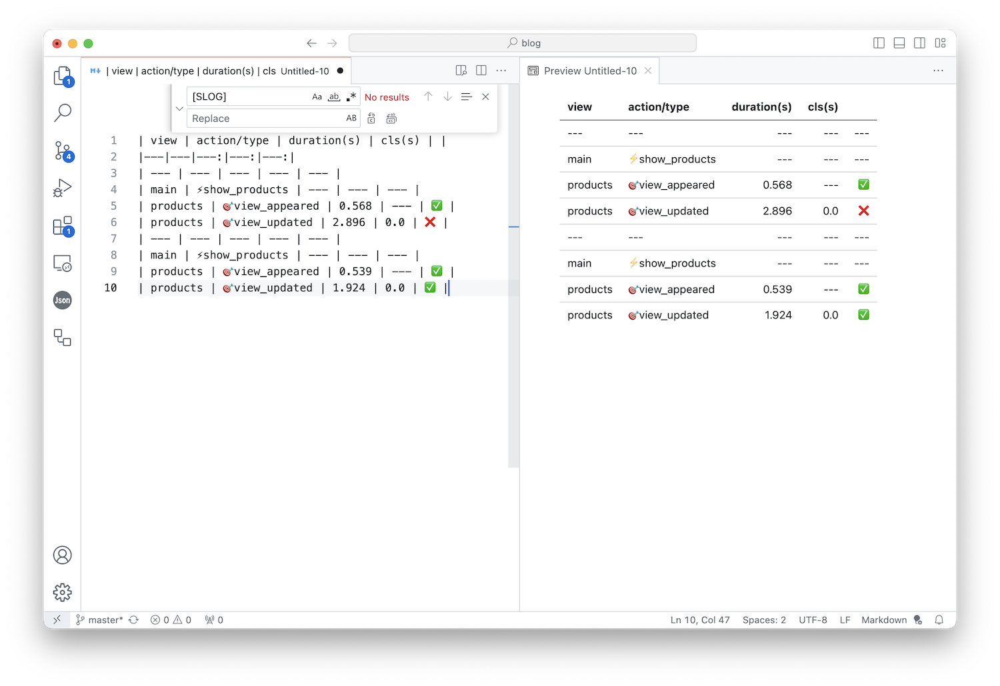

## Project này có gì?

Đây là một dự án nhỏ demo việc đo độ phản hồi của application đến người dùng, thông qua đó, các nhà phát triển có thể cải thiện UX của ứng dụng.

Tôi cảm thấy có nhiều metric quan trọng trong việc đo độ phản hồi mà không có library nào có để đo được thông qua vài cấu hình đơn giản, bạn chỉ có thể có được các chỉ số mà bạn cần thông qua việc đặt thêm các code đo lường vào source code.

---
Ví dụ: 
- Khi user thực hiện một action click button.

  - Nếu cần phải chuyển view, không được trễ hơn 500ms cho việc present view tiếp theo, hiển nhiên sau khi present data có vẫn chưa được render hoàn chỉnh, cần có indicator để user nhận thức được ứng dụng đang trong luồng xử lý action.

  - Nếu không cần chuyển view, tôi muốn ứng dụng phải hiện indicator cho các xử lý cần tốn nhiều thời gian, việc xuất hiện indicator không được trễ hơn 100ms từ khi user tap vào button để người dùng có cảm giác ứng dụng đã phản hồi các action ngay lập tức.

- Cần duy trì indicator cho đến khi data được render xong, Nhưng tối đa sau 2s từ khi user click button data cần được render hoàn chỉnh. 

- Việc render data trên view có thể được update nhiều lượt, nhưng cần cố gắng để giữ chỉ số CLS (Cumulative Layout Shift) dưới 0.2s.

---

Lưu ý: các chỉ số thời gian trong ví dụ trên chỉ là mong đợi đối với mội người dùng dễ tính như tôi, các chỉ số trên tôi chấp nhận được, thực tế có thể còn khắt khe hơn.

Quan trọng nhất là làm sao developer chúng ta có đủ các chỉ số chúng ta cần trước khi quyết định các xử lý cần cải thiện?